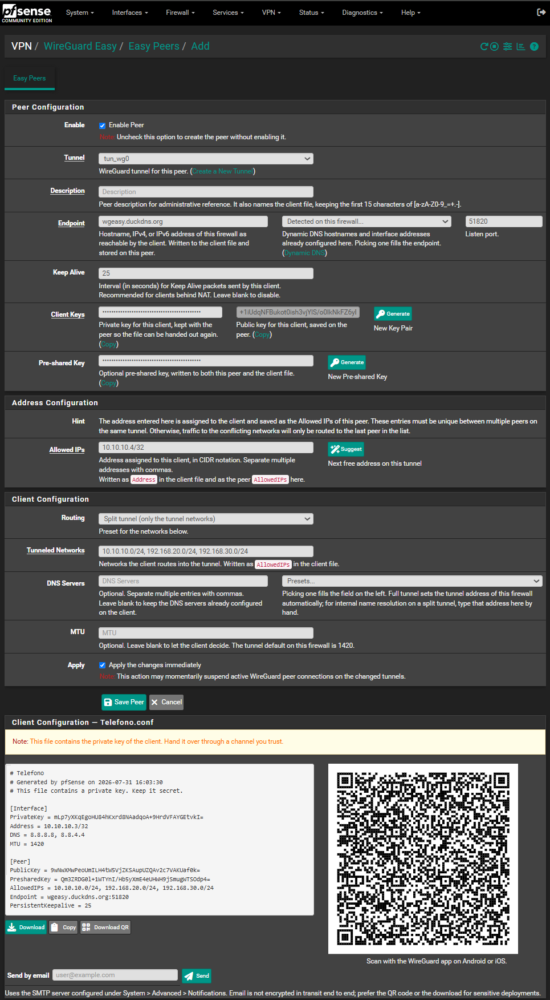
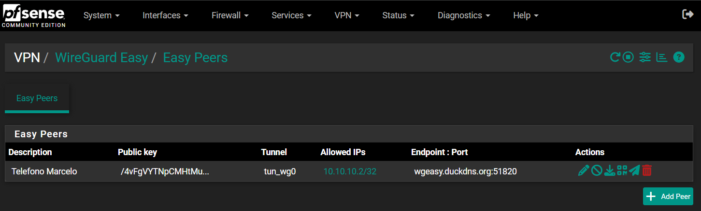
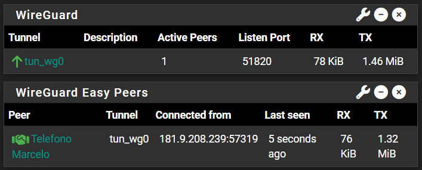

# WireGuard Easy for pfSense

Adds **VPN → WireGuard Easy** to pfSense: a single page to create a WireGuard
client and hand it its configuration file, with a QR code, a download button
and email delivery.

The native `pfSense-pkg-WireGuard` package expects you to generate the client
key pair yourself, paste the public key into a peer, and then write the client
`.conf` by hand. This package does all of that in one form.

> Requires `pfSense-pkg-WireGuard`. **No file belonging to that package is
> modified**, so it survives upgrades of the native package.

Tested on pfSense CE 2.8.1 with pfSense-pkg-WireGuard 0.2.9_6.

## Screenshots

One form creates the peer and produces the client file, with the QR code ready
to scan and a button to download it or send it by email:



The peer list, with per row actions to hand the file out again:



The dashboard widget, next to the native WireGuard one. The native widget
counts active peers; this one names them and shows where they are connected
from:



## What it does

**Easy Peers** lists your peers with the same columns as the native Peers page,
plus per row actions to download the client file, download its QR code as a
PNG, and send it by email.

**Add Peer** opens a form that mirrors the native peer editor and fills in
everything it can from your firewall:

| Field | Where the value comes from |
|---|---|
| Client key pair | Generated with `wg(8)`, shown before saving |
| Allowed IPs | Next free address in the tunnel subnet |
| Endpoint | Your Dynamic DNS hostnames, RFC 2136 entries and interface addresses, in a dropdown |
| Endpoint port | The listen port of the selected tunnel |
| Tunneled Networks | The subnets your DHCP server serves, plus the tunnel network |
| DNS servers | The tunnel address on full tunnel, or a preset (Google, Cloudflare, Quad9, the firewall's own) |
| Pre-shared key | Generated, and can be cleared |

In practice: type a name, press Save, hand over the file.

**Dashboard widget.** The native WireGuard widget shows how *many* peers are
active. This one shows *who*: peer name, tunnel, the address they are connected
from, when they were last seen, and their traffic counters.

## Getting the file onto the phone

The client file is always downloaded as a `.zip`. Every WireGuard client
accepts an archive, and a `.zip` survives being emailed or passed through a
messenger, which a bare `.conf` often does not.

Worth knowing, because it surprises everyone once: **the Android app does not
register itself as a handler for configuration files**. Tapping the file in
WhatsApp, Gmail or a file manager will never offer WireGuard, no matter what
the file is called. Importing always goes through the app itself: **+ → Import
from file or archive**. On iOS the app does declare the type, so sharing a file
to it works there.

That leaves three ways to deliver a client, depending on the situation:

| Situation | What to use |
|---|---|
| The phone is in front of you and you have a second screen | Scan the QR code |
| The phone is the device you are configuring | Browse to pfSense from the phone, download the `.zip`, then import it in the app |
| The user is somewhere else | Email or messenger, and tell them to import from inside the app |

Scanning the QR from the screen of the same phone being configured is not
possible with any app.

## Install

Download the `.pkg` from [Releases](../../releases), copy it to the firewall and
install it:

```sh
scp pfSense-pkg-wgeasy-<version>.pkg root@FIREWALL:/root/
ssh root@FIREWALL
pkg add /root/pfSense-pkg-wgeasy-<version>.pkg
```

`pkg add` warns that the package does not come from a repository. That is
expected. Then open **VPN → WireGuard Easy**.

To remove it:

```sh
pkg delete -y pfSense-pkg-wgeasy
```

pfSense system upgrades only reinstall packages from the official repository,
so run `pkg add` again after upgrading pfSense. Your peers live in `config.xml`
and are not affected.

There is also a manual, file by file installation in
[wgeasy/INSTALL.md](wgeasy/INSTALL.md), and `build/make-pkg.ps1` rebuilds the
`.pkg` from source on Windows.

## How it works

Peers are created through the native package's own API, not by editing
`config.xml` directly:

- `wg_do_peer_post()` saves the peer, so the native validation, the `.conf`
  generation via `wgconfig.class.php` and the kernel sync all run exactly as if
  you had used **Peers → Edit**.
- Keys come from `wg_gen_keypair()` / `wg_gen_publickey()`, which shell out to
  `wg(8)` with proper escaping.
- Applying changes uses the same `mark_subsystem_dirty()` +
  `wg_apply_list_add()` + `wg_tunnel_sync()` path as the native pages.
- Toggling and deleting a peer call `wg_toggle_peer()` and `wg_delete_peer()`.

A peer created here is a normal peer: you can edit or delete it from
**VPN → WireGuard → Peers** and nothing breaks.

## What it stores, and the trade-off

To be able to hand a client file out again later — re-download it, show the QR
again, resend the email — this package stores the client private key and the
settings used to build the file in a `<wgeasy>` element inside the peer:

```xml
<item>
  <descr>phone</descr>
  <publickey>...</publickey>
  <wgeasy>
    <privatekey>...</privatekey>
    <endpoint>vpn.example.com</endpoint>
    ...
  </wgeasy>
</item>
```

**This means client private keys end up in `config.xml`, and therefore in your
configuration backups and in AutoConfigBackup.** That is a deliberate
trade-off: the alternative is that a client file exists exactly once, on the
screen that created it, and a user who loses it needs a brand new peer.

Peers created by hand in the native page have no such element. They show up in
the list marked as having no client file, and can still be edited.

The element is namespaced and inert: the native package ignores unknown keys,
and removing the package leaves it as harmless dead data.

## Development

`preview/` runs the pages in a browser on Windows or Linux without a firewall.
It stubs the pfSense core (config.xml becomes a JSON file, the `Form_*` classes
are reimplemented, `wg`/`ifconfig` are faked with libsodium doing the real key
derivation) but loads the **real** WireGuard package includes, so the
integration being exercised is genuine.

```sh
php -S 127.0.0.1:8088 -t preview preview/router.php   # then open the URL
php -f preview/verify.php                             # end to end test suite
```

The suite checks the things that actually matter: that the private key in the
generated file derives to the public key stored on the peer, that the peer
lands in the tunnel `.conf`, that duplicate addresses are rejected, that
Dynamic DNS entries of every shape are detected, and so on.

See [preview/README.md](preview/README.md) for what is real and what is
simulated.

## Credits

- [pfSense-pkg-WireGuard](https://github.com/pfsense/FreeBSD-ports/tree/devel/net/pfSense-pkg-WireGuard)
  by Netgate and R. Christian McDonald. This package is a thin layer on top of
  its API and follows its conventions.
- QR code generation uses [qrcode.js](https://github.com/davidshimjs/qrcodejs)
  by davidshimjs (MIT), in the SVG only variant published with
  [pfSense-wireguard-peer-export](https://github.com/3um3le3ee/pfSense-wireguard-peer-export).
  The original license header is kept in the file.
- The preview harness bundles [jQuery](https://jquery.com/) (MIT), which pfSense
  itself loads on every page. It is only used to run the pages off the firewall.

## License

Apache License 2.0. See [LICENSE](LICENSE).
